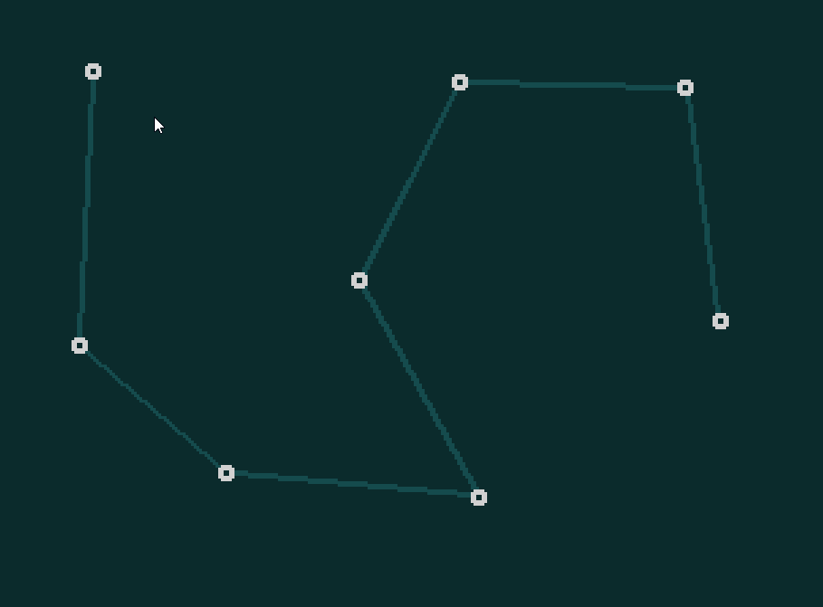

# Cards'n'Castles

For up-to-date information please see the Itch.io page for this project, here: https://sambigos.itch.io/cardsncastles

# About

Cards'n'Castles is build with Godot 3.2, and developed by Sam Bigos, a games industry engineer based in Brighton, UK, who is doing his first GameJam for fun, as a learning experience, and as an escape from the tedium of professional game development.

Playable HTML5 build can be found here: https://samuelbigos.github.io/cards_n_castles/

Thank you for your interest!
